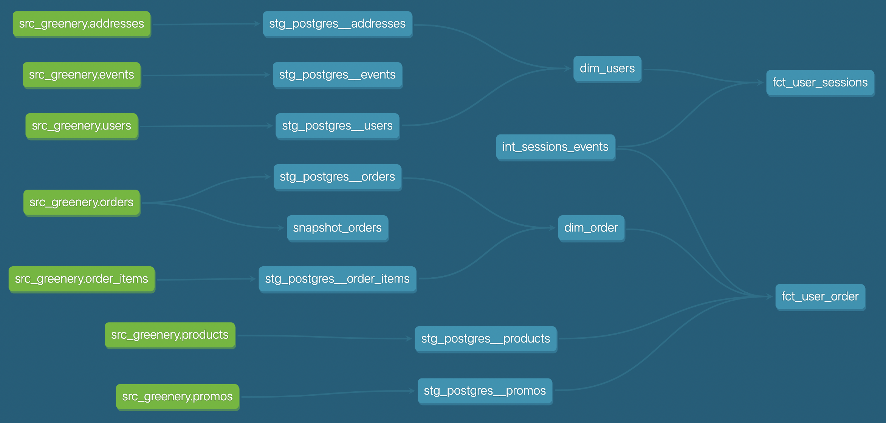

```
with repeats as (
select user_guid, 
    case when count(distinct order_guid) > 1 then 'repeat'
    else 'no_repeat'
    end as repeat_status
from 
    dev_db.dbt_kushimokolawole.stg_postgres__orders
group by 
    user_guid
),
repeat_count as (
    select
        sum(case when repeat_status = 'repeat' then 1 else 0 end) as repeats,
        sum(case when repeat_status = 'no_repeat' then 1 else 0 end) as no_repeats,
        count(user_guid) as total
from 
    repeats
)
select repeats/total as repeat_rate from repeat_count;
```

## DAG


## Snapshot

```
select * from dev_db.dbt_kushimokolawole.snapshot_orders
where dbt_valid_to is not null;
```